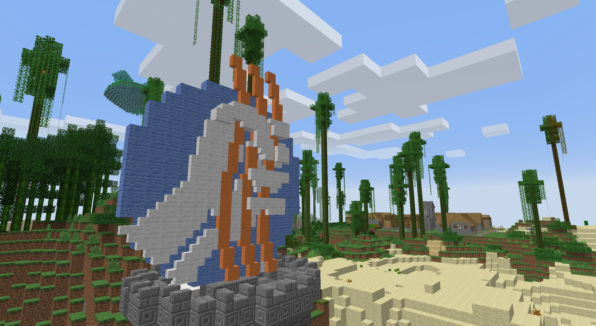

Title: The Baconia Modpack is Live!
Authors: Dowdy90
Date: 2015-07-05 14:00
Category: content-pack
Tags: Update;, Minecraft;, modpack;, content-pack
Summary: With a bit of work, we now have a hosted modpack to play on.

We now have our own modpack with our own privately hosted server! We call it.... __The Baconia Modpack!__

The modpack is designed to be less intense that some of the complete packs out there, catering specifically to our own play styles in minecraft. This modpack gives a degree of calming building, interesting exploration, cool building options, mechanical variety and even a little bit of rping.

###Modpack###
The modpack is distributed via the technic launcher:
[Baconia](https://www.technicpack.net/modpack/baconia "Baconia")

Or copy __http://api.technicpack.net/modpack/baconia__ into your technic launcher. 

Alternatively the mods, configs and server.properties are available [here.](/downloads/baconia_latest.tar.gz "Baconia Mods Download") This is most useful for server hosting.

###Server IP###
Our server can be found at: __pbrb.co.uk__

###Texture Packs###
Sphax vanilla can be downloaded at: [Sphax 1.7.10](https://adf.ly/564553/spbdc-128-mc17)

Then you can patch on our custom addon pack: [Baconia Texture Pack](https://www.dropbox.com/s/qfl05q1rlglghcn/128%20Baconia%201.7.10%20v1.1.zip?dl=1)

(A guide to patching texture packs can be found [here](https://i.imgur.com/JJS3KjC.png "Guide").)
