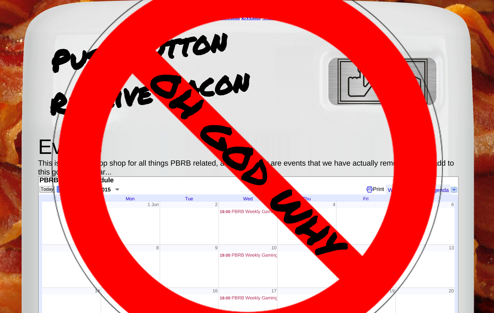
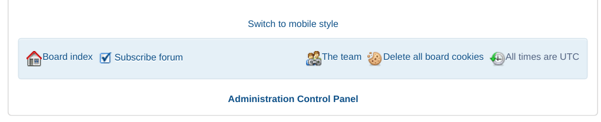

Title: It's Like A Whole New Site
Authors: GabeTheCabbage
Date: 2015-06-23 10:49
Category: Event
Tags: Update;, Website;, Tutorial
Summary: PBRB's clan site has had a bit of an update...

<div style="text-align:center" markdown="1">



</div>

As you will have noticed the website no longer:
 
* Take's 15 minutes to load,
* Eats all your RAM 8MP background textures,
* Works inconsistently across various browsers,
* It is now far easier to create new content (see below)
* Causes profuse bleeding of the eyes and incredulity!

All of this is made possible by our adoption of [Pelican](https://github.com/getpelican/), a static site builder which can process Markdown, reStructured Text (what ever that is), AsciiDoc or even HTML (shock horror).

###Creating Content

As mentioned above you can now author blog posts or pages in friendly, easy to read markdown! However some non-markdown metadata is required at the start of the file to begin with, for example;

```markdown
Title: It's Like A Whole New Site
Authors: GabeTheCabbage
Date: 2015-06-23 10:49
Category: Event
Tags: Update;, Website;, Tutorial
Summary: PBRB's clan site has had a bit of an update...
```

This is the metadata for this post. Some other useful metadata tags exist and can be found in the [Pelican Documentation](http://docs.getpelican.com/en/3.6.0/content.html#file-metadata).

---

All the posts I have thus far created have used a mix of markdown and HTML, for example, below is a post for a Video by Dowdy.


```markdown
Title: [PBRB] Dowdy - Channel Update
Date: 2015-06-16 12:52
Category: Video
Author: Dowdy90
Tags: Mount and Blade

<iframe width="100%" height="315" src="https://www.youtube.com/embed/TOezKSF8vC0" frameborder="0" allowfullscreen></iframe>


Hey guys, to slowly get us back into editing, recording and general podcast/video making, I have a new video!

I am hoping to get into a routine of recording after work.

Hope you enjoy guys (sorry about the Thumbnail).
```

HTML can be useful for doing more complex formatting for images such as resizing and centring in the frame. More information can be found at the [Pelican Documentation](http://docs.getpelican.com/en/3.6.0/content.html).

So there we go, go forth and make blog posts, just forum message/email/carrier pigeon them to me and I'll put them up.

##Forum Updates

**Update: The forum (see barren waasteland) is long defuct and this post remains largely uneditted for posterity**

Other then taking it out of that daft hand-dryer iframe, the forum has not changed much really. However;

* The PBRB logo does now redirect back to the main website,
* The desktop theme sports the same background as the new website (get hype),
* And we have a functional mobile theme that should enable on small devices!

###Twitter Intergration (or rather lack of...)
A popular feature idea within the community has been twitter integration, allowing the forum to tweet out upon creation of a new topic. This has not been possible given the lack of an available mod that works with Twitters more modern authentication methods.

However there is an alternative solution available already within the Bullitin Board. In the footer of each topic is a Subscribe button.


<div style="text-align:center" markdown="1">



</div>

This is disabled by default but once clicked you will receive emails upon uploads to the chosen board. We would recommend subscribing to [News](http://pbrb.co.uk/phpbb/viewforum.php?uid=63&f=10&start=0) at least. This will allow users to subscribe only to forums pertaining to games they are interested in playing.
